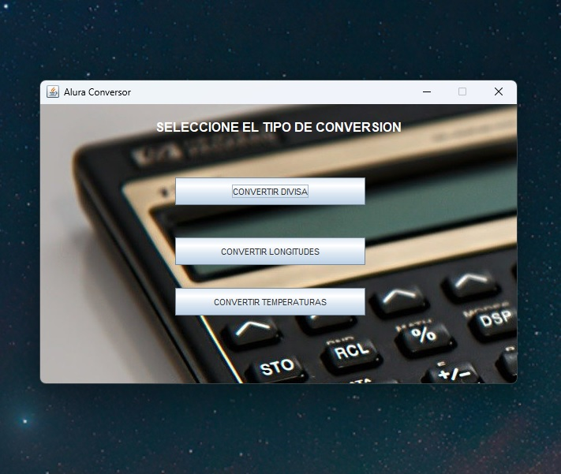
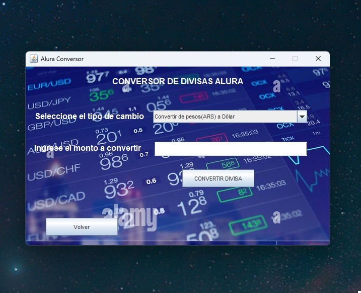
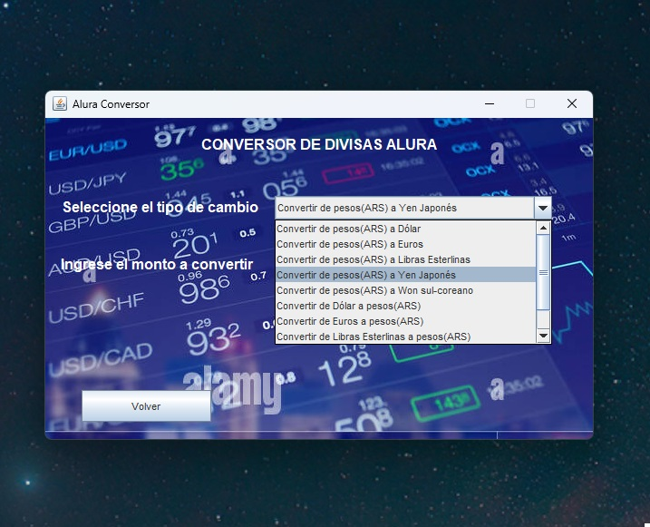
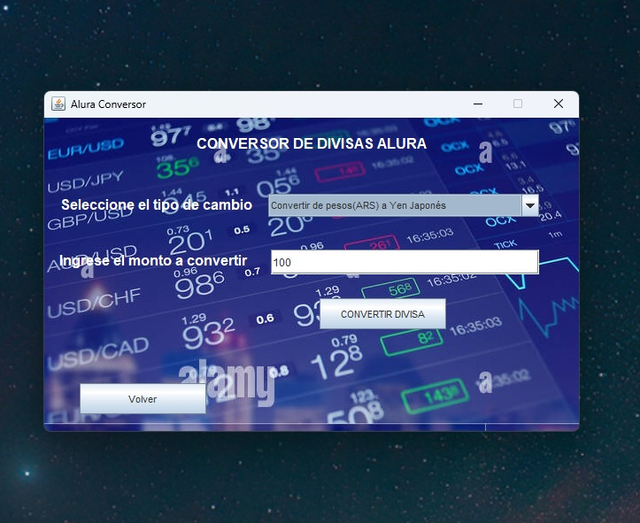
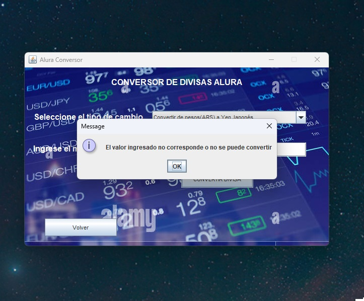
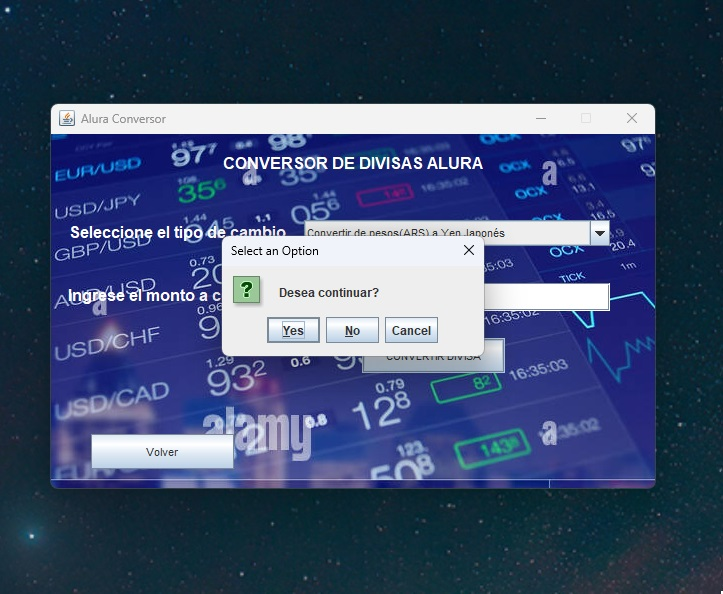
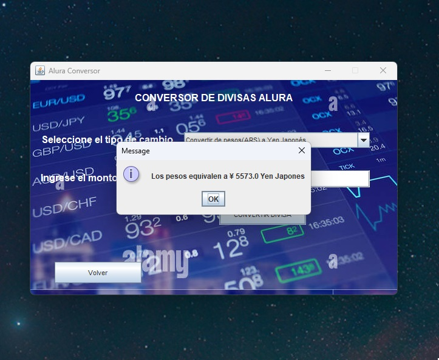
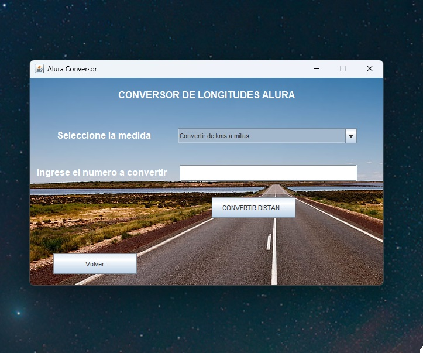
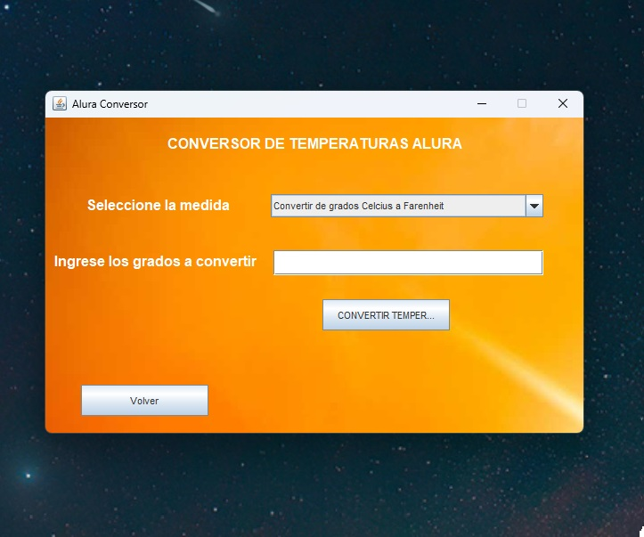

# Alura-Conversor
Proyecto de caracter academico para la practica de los principios de la POO en lenguaje Java con Swing para la interfaz grafica.

Este programa tiene la finalidad de realizar distintos tipos de conversiones numericas.
El requerimiento principal es la conversion de divisas, teniendose en cuenta al peso argentino como moneda local.
      - Convertir de la moneda de tu país a Dólar
      - Convertir de la moneda de tu país  a Euros
      - Convertir de la moneda de tu país  a Libras Esterlinas
      - Convertir de la moneda de tu país  a Yen Japonés
      - Convertir de la moneda de tu país  a Won sul-coreano
      - Convertir de Dólar a la moneda de tu país
      - Convertir de Euros a la moneda de tu país
      - Convertir de Libras Esterlinas a la moneda de tu país
      - Convertir de Yen Japonés a la moneda de tu país
      - Convertir de Won sul-coreano a la moneda de tu país

Como funcionalidades agregadas este programa podra convertir longitudes de kms y millas.

Y tambien convertir grados de temperatura celsius, kelvin y farenheit.

